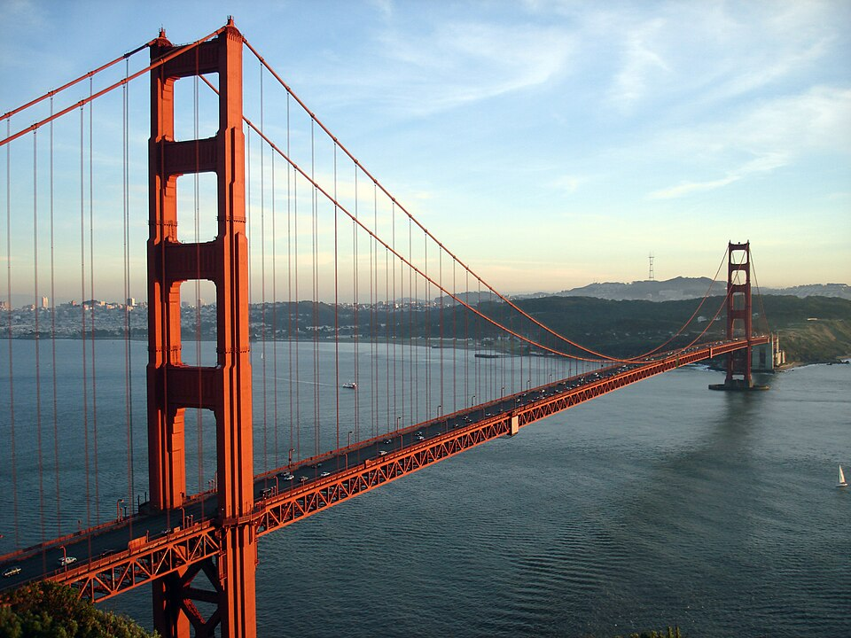
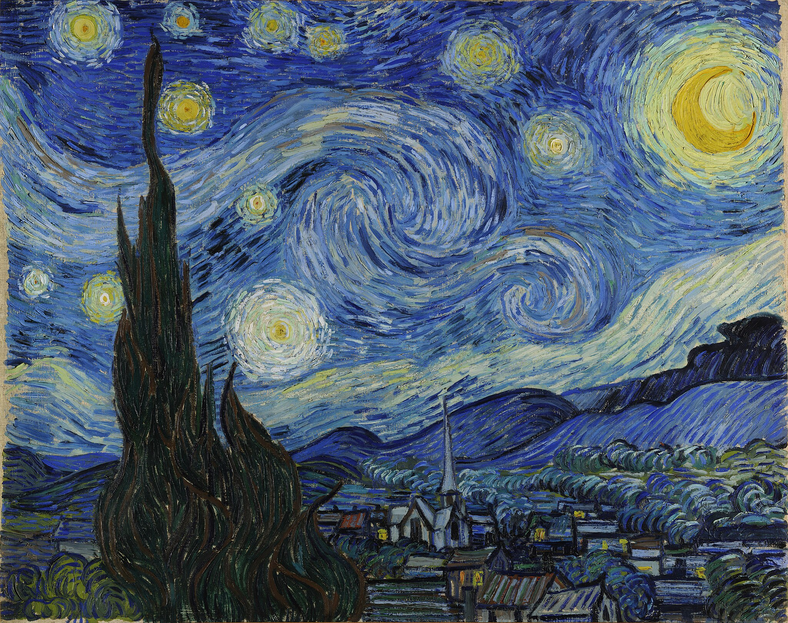
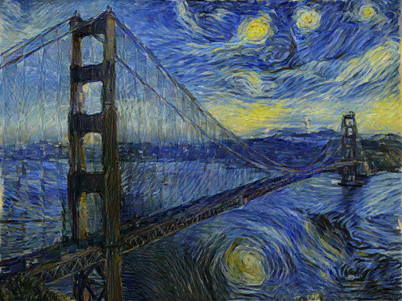

✅ README.md
markdown
Copy
Edit
# 🎨 Neural Style Transfer with PyTorch

This project performs **Neural Style Transfer** using a pre-trained VGG19 model. It blends the content of one image with the style of another using deep learning, inspired by the paper [A Neural Algorithm of Artistic Style](https://arxiv.org/abs/1508.06576).

> 📍 **Run it on Google Colab**:  
> [](https://colab.research.google.com/drive/1YTnsudCzvQXWvgVzgpoKFzgyL-R_DDP3?usp=sharing)

---

## 🧪 Example Results

| Content Image | Style Image | Output Image |
|---------------|-------------|--------------|
|  |  |  |


---

## 🚀 Features

- Use any image pair for content & style
- Optimized to run in Google Colab (GPU support)
- Logs losses per iteration (no image display for fast debugging)
- Fully written in PyTorch

---

## 🛠️ How to Use

### ✅ On Google Colab

1. Open the notebook: [Colab Link](https://colab.research.google.com/drive/1YTnsudCzvQXWvgVzgpoKFzgyL-R_DDP3?usp=sharing)
2. Cheange the content.jpg and style.jpg (optional)
3. Run the notebook!

### ✅ Locally

```bash
pip install torch torchvision Pillow
python main.py
Make sure content.jpg and style.jpg are present in the working directory.

⚙️ Parameters
content.jpg: The base image to retain structure from.

style.jpg: The reference image whose texture will be used.

iterations: Number of optimization steps (default: 500).

output.png: Final result image (optional).
